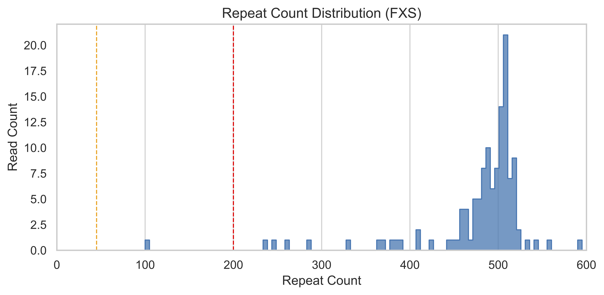

# MASTRseq Snakemake Pipeline

This Snakemake pipeline supports short tandem repeats (STR) counting, methylation profiling analysis from nanopore long-read sequencing data.

# Installation


#### Pre-installation(only required for osx-arm64)
Currently, the ont-modkit package (version 0.5.0), a bioinformatics tool for analyzing modified bases from Oxford Nanopore, is distributed via Bioconda for the following platforms: linux-64, osx-64 (Intel-based macOS), and linux-aarch64. But, there is no osx-arm64 (Apple Silicon) build available at this time.
For macOS Apple Silicon users, modkit can be installed natively using the Cargo tool:

```bash
cargo install --git https://github.com/nanoporetech/modkit.git
```

### Conda environment setup
Snakemake requires Conda version 24.7.1 or later.  
Create a conda environment using the following `env.yaml`:

```yaml
name: mastrseq
channels:
  - conda-forge
  - bioconda
  - defaults
dependencies:
  - python=3.12
  - pandas=2.2.2
  - matplotlib=3.9.2
  - pysam=0.22.1
  - seaborn=0.13.2
  - samtools=1.20
  - numpy
  - snakemake
  - graphviz
  - ont-modkit=0.5
```

### Run the conda command to create the environment:

```bash
conda env create -f env.yaml
```

### Activate the environment:

```bash
conda activate mastrseq
```


# Usage
### General configuration

```python
# Load pipeline configuration
configfile: "config.yaml"

SAMPLES = config["samples"]
INPUT_DIR = config["input_dir"]
OUTPUT_DIR = config["output_dir"]
STR_type = config["str_type"]
REF_DIR = config["ref_dir"]
ENV = "env.yaml"
```
**Note**: The `methylation_inSTR` and `methylation_inSTR_plot` rules are excluded for the HTT STR type.

### Set up `config.yaml` 
Adjust the following parameters in your config.yaml file:
#### >Input samples, 
Place your sorted and indexed BAM files in the INPUT_DIR folder. File names must follow the format:
```
{sample_name}.sorted.bam
{sample_name}.sorted.bam.bai
```
#### >output paths: e.g., ``` results/mastrseq_run ```  
#### >reference directory: path to the reference genome, e.g., ``` reference/hg39.fa ``` 
#### >STR type: (e.g., `FMR1`, `HTT`, or `C9ORF72`)
#### >STR seq motif: (e.g., `CGG`, `CAG`, or `GGCCCC`) 
#### >methylation threshold: 
Recommended values: 0.6

#### >mutation length threshold. 
      Leave as "" to disable length stratification
     Example recommended values: 30 for ALS C9ORF72 (G4C2); 45 for FXS FMR1 (CGG)

Then run the snakemake pipeline using the following commands:

```bash
snakemake --cores <NUM_CORES>
```
<NUM_CORES> specifies the number of CPU cores for alignment.


# Results

After running the pipeline, results will be organized inside your specified `{OUTPUT_DIR}`.  

### Example outputs

- **STR counting**  
  - Text tables:  
    ```
    {OUTPUT_DIR}/str_count/{sample}_allcounts.txt
    ```
  - Plot:  
    ```
    {OUTPUT_DIR}/str_plot/{sample}_str_plot.pdf
    ```

- **Methylation profiling around STRs**  
  - Filtered BAM and index:  
    ```
    {OUTPUT_DIR}/methylation_aroundSTR/{sample}_filtered.bam
    {OUTPUT_DIR}/methylation_aroundSTR/{sample}_filtered.bam.bai
    ```
  - Extracted CpG calls:  
    ```
    {OUTPUT_DIR}/methylation_aroundSTR/{sample}_filtered_extractCpG.tsv
    ```
  - Plot:  
    ```
    {OUTPUT_DIR}/methylation_plot/{sample}_methylation_density_{STR type}.pdf
    ```

- **Methylation inside STRs (if applicable)**  
    ```
    {OUTPUT_DIR}/methylation_inSTR/{sample}_methylation_inSTR_density_plot.pdf
    {OUTPUT_DIR}/methylation_inSTR/{sample}/STRlength_5mC-likelihood.tsv
    {OUTPUT_DIR}/methylation_inSTR/{sample}/plots_for_each_read/*.png
    ```

---

### Example plots

Here are some representative plots generated by the pipeline:

#### CGG STR length distribution in fragile X syndrome (FXS)


#### Methylation density around STRs in fragile X syndrome (FXS)


#### Methylation density within STRs in fragile X syndrome (FXS)


#### Methylation per read inside STRs in fragile X syndrome (FXS)


---

### Logs

All logs are stored in `{OUTPUT_DIR}/logs/`, including:

If you run sucessfully, you will see output files in <OUTPUT_DIR>. look like this:
```
{OUTPUT_DIR}/logs/str_count/{{sample}}.log
{OUTPUT_DIR}/log/str_count_plot/{{sample}}.log
{OUTPUT_DIR}/logs/methylation_aroundSTR/{{sample}}.log
{OUTPUT_DIR}/logs/methylation_density_plot/{{sample}}.log
{OUTPUT_DIR}/logs/methylation_inSTR/{{sample}}.log
{OUTPUT_DIR}/logs/methylation_inSTR_plot/{{sample}}.log
```
# Citation
If you use **MASTR-seq Snakemake pipeline**, please cite:  

Chuanbin Su, Han-Seul Ryu, Keerthivasan Raanin Chandradoss, Thomas Malachowski, et al. MASTR-seq: Multiplexed Analysis of Short Tandem Repeats with sequencing.  
*Updating…*  
DOI: [insert DOI link here](#) 

# Limitations
The **MASTRseq snakemake pipeline** has been developed and tested to accurately quantify simple repeats (e.g., **CGG, CAG, GGCCCC**).  
However, it currently cannot process **mixed repeats** composed of different motifs.

# Contact Us
If you need help, please [open an issue](../../issues) on the GitHub issue page.  
You may also contact:  
- **Dr. Chuanbin Su** (chuanbin@seas.upenn.edu)  
- **Dr. Jennifer Cremins** (jcremins@seas.upenn.edu)  


